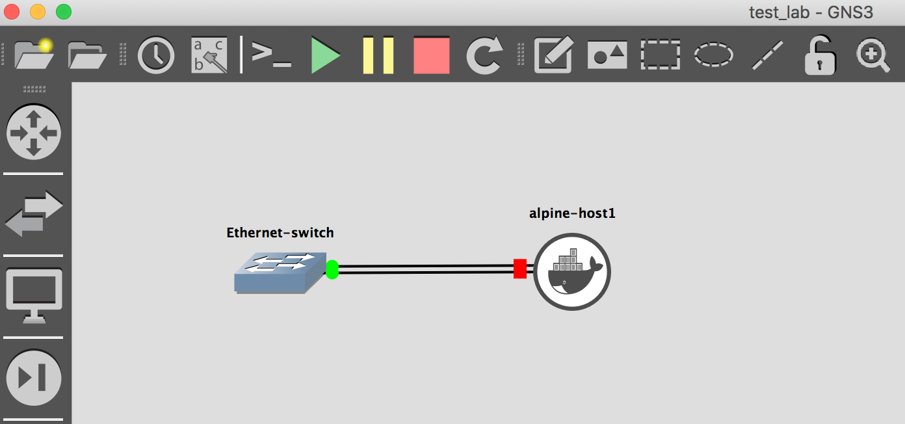

# How it works

The library provide the following interfaces:

- `Gns3Connector`: Main object that interacts with the GNS3 server REST API and its objective is to be its interface.
- `Project`: Interface of a project/lab defined.
- `Node`: Interface of a node/entity defined.
- `Link`: Interface of a link defined.

The `Gns3Connector` is mandatory and needs to be assigned to the `Project`, `Node` or `Link` object you want to work with, the latter uses the connector to interact with the REST API.

Next you can see different ways to interact with the library.

## Interact with existing Project

### Gns3Connector and Project objects

Here is an example of defining a connector object and a project that is already configured on a local GNS3 server:

```python
from gns3fy import Gns3Connector, Project

server = Gns3Connector("http://localhost:3080")

lab = Project(name="API_TEST", connector=server)

# Retrieve its information and display
lab.get()

print(lab)
# Project(project_id='4b21dfb3-675a-4efa-8613-2f7fb32e76fe', name='API_TEST', status='opened', ...

# Access the project attributes
print(f"Name: {lab.name} -- Status: {lab.status} -- Is auto_closed?: {lab.auto_close}")
# Name: API_TEST -- Status: closed -- Is auto_closed?: False

# Open the project
lab.open()
print(lab.status)
# opened

# Verify the stats
print(lab.stats)
# {'drawings': 0, 'links': 4, 'nodes': 6, 'snapshots': 0}

# List the names and status of all the nodes in the project
for node in lab.nodes:
    print(f"Node: {node.name} -- Node Type: {node.node_type} -- Status: {node.status}")
# Node: Ethernetswitch-1 -- Node Type: ethernet_switch -- Status: started
# ...
```

As noted before you can also use the `Gns3Connector` as an interface object to the GNS3 server REST API.

```python
In [1]: from gns3fy import Gns3Connector, Project, Node, Link

In [2]: server = Gns3Connector(url="http://localhost:3080")

In [3]: server.get_version()
Out[3]: {'local': False, 'version': '2.2.0b4'}

In [4]: server.get_templates()
Out[4]:
[{'adapter_type': 'e1000',
  'adapters': 13,
  'bios_image': '',
  'boot_priority': 'c',
  'builtin': False,
  'category': 'router',
  'cdrom_image': '',
  'compute_id': 'local',
  ...
```
### Node and Link objects

You have access to the `Node` and `Link` objects as well, and this gives you the ability to start, stop, suspend the individual element in a GNS3 project.

```python
from gns3fy import Node, Link, Gns3Connector

PROJECT_ID = "<some project id>"
server = Gns3Connector("http://<server address>:3080")

alpine1 = Node(project_id=PROJECT_ID, name="alpine-1", connector=server)

alpine1.get()
print(alpine1)
# Node(name='alpine-1', node_type='docker', node_directory= ...

# And you can access the attributes the same way as the project
print(f"Name: {alpine1.name} -- Status: {alpine1.status} -- Console: {alpine1.console}")
# Name: alpine-1 -- Status: started -- Console: 5005

# Stop the node and start (you can just restart it as well)
alpine1.stop()
print(alpine1.status)
# stopped

alpine1.start()
print(alpine1.status)
# started

# You can also see the Link objects assigned to this node
print(alpine1.links)
# [Link(link_id='4d9f1235-7fd1-466b-ad26-0b4b08beb778', link_type='ethernet', ....

# And in the same way you can interact with a Link object
link1 = alpine1.links[0]
print(f"Link Type: {link1.link_type} -- Capturing?: {link1.capturing} -- Endpoints: {link1.nodes}")
# Link Type: ethernet -- Capturing?: False -- Endpoints: [{'adapter_number': 2, ...
```

## Creating a new Project

You can find here a couple of methods that are available on the interfaces provided by the library.

To navigate to some of them and see their value, lets create a simple lab on the server with 2 nodes connected betweem each other.

### Project creation

Lets start by creating a lab called `test_lab`

```python
In [1]: from gns3fy import Gns3Connector, Project, Node, Link

In [2]: server = Gns3Connector(url="http://localhost:3080")

In [3]: lab = Project(name="test_lab", connector=server)

In [4]: lab.create()

In [5]:

In [5]: lab
Out[5]: Project(project_id='e83f1275-3a6f-48f7-88ee-36386ee27a55', name='test_lab', status='opened',...
```

You can see you get the `project_id`. In GNS3 the project ID is key for all interactions under that project.

!!! Note
    For a complete list of the attibutes you can see the [API Reference](api_reference.md#project-objects)

### Node creation

Next, lets try and create a Ethernet switch node. For this we need to know the template and node type of it.

```python hl_lines="6"
In [7]: for template in server.get_templates():
   ...:     if "switch" in template["name"]:
   ...:         print(f"Template: {template['name']} -- ID: {template['template_id']}")
   ...:
   ...:
Template: Ethernet switch -- ID: 1966b864-93e7-32d5-965f-001384eec461
Template: Frame Relay switch -- ID: dd0f6f3a-ba58-3249-81cb-a1dd88407a47
Template: ATM switch -- ID: aaa764e2-b383-300f-8a0e-3493bbfdb7d2

In [8]: server.get_template_by_name("Ethernet switch")
Out[8]:
{'builtin': True,
 'category': 'switch',
 'console_type': 'none',
 'name': 'Ethernet switch',
 'symbol': ':/symbols/ethernet_switch.svg',
 'template_id': '1966b864-93e7-32d5-965f-001384eec461',
 'template_type': 'ethernet_switch'}
```

By knowing the template information of the device we can create the Node instace of it

```python

In [9]: switch = Node(
    project_id=lab.project_id,
    connector=server,
    name="Ethernet-switch",
    node_type="ethernet_switch",
    template="Ethernet switch"
)

In [10]: switch.create()

In [11]: switch
Out[11]: Node(name='Ethernet-switch', project_id='6e75bca5-3fa0-4219-a7cf-f82c0540fb73', node_id='c3607609-49...
```

!!! Note
    For a complete list of the attibutes you can see the [API Reference](api_reference.md#node-objects)

Now lets add an docker Alpine host to the project (**NOTE:** The docker image and template needs to be already configured in GNS3)

```python
In [12]: alpine = Node(
    project_id=lab.project_id,
    connector=server,
    name="alpine-host",
    node_type="docker",
    template="alpine"
)

In [13]: alpine.create()

In [14]: alpine
Out[14]: Node(name='alpine-host', project_id='6e75bca5-3fa0-4219-a7cf-f82c0540fb73', node_id='8c11eb8b...

In [15]: alpine.properties
Out[15]:
{'adapters': 2,
 'aux': 5026,
 'category': 'guest',
 'console_auto_start': False,
 'console_http_path': '/',
 'console_http_port': 80,
 'console_resolution': '1024x768',
 'console_type': 'telnet',
 'container_id': 'f26b6aee763a9399c93c86032b75717c57b260e5010e88c4d410ce13554771df',
 'custom_adapters': [],
 'environment': '',
 'extra_hosts': '',
 'extra_volumes': [],
 'image': 'alpine:latest',
 'start_command': '',
 'symbol': ':/symbols/affinity/circle/gray/docker.svg',
 'usage': ''}

In [16]: alpine.ports
Out[16]:
[{'adapter_number': 0,
  'data_link_types': {'Ethernet': 'DLT_EN10MB'},
  'link_type': 'ethernet',
  'name': 'eth0',
  'port_number': 0,
  'short_name': 'eth0'},
 {'adapter_number': 1,
  'data_link_types': {'Ethernet': 'DLT_EN10MB'},
  'link_type': 'ethernet',
  'name': 'eth1',
  'port_number': 0,
  'short_name': 'eth1'}]
```

You can access all of the host attributes and see their specifications based on the template defined on the server.

To update the `lab` object with their latest nodes added

```python
In [17]: lab.get()

# I have shorten the output shown
In [18]: lab.nodes
Out[18]:
[Node(name='Ethernet-switch', project_id='6e75bca5-3fa0-4219-a7cf-f82c0540fb73', node_id='c3607609...
Node(name='alpine-host1', project_id='6e75bca5-3fa0-4219-a7cf-f82c0540fb73', node_id='8c11eb8b...
]
```

### Link creation

Next lets create a link between the switch and the alpine host.

`Switch Etherner0 <--> Alpine Eth1`

```python

In [15]: lab.create_link('Ethernet-switch', 'Ethernet0', 'alpine-host1', 'eth1')
Created Link-ID: b0d0df11-8ed8-4d1d-98e4-3776c9b7bdce -- Type: ethernet

In [16]: lab.links
Out[16]: [Link(link_id='b0d0df11-8ed8-4d1d-98e4-3776c9b7bdce', link_type='ethernet', project_id='6e7
```
!!! Note
    For a complete list of the attibutes you can see the [API Reference](api_reference.md#link-objects)

This is one way to create a link (using the `lab` object), but you can also create it using a `Link` instance as well.

We need the link mapping to be set under the `nodes` attribute of the `Link` instance. For this we need:

- `node_id`
- `adapter_number`
- `port_number`

```python hl_lines="9 13 19 23"

In [17]: switch.ports
Out[17]:
[{'adapter_number': 0,
  'data_link_types': {'Ethernet': 'DLT_EN10MB'},
  'link_type': 'ethernet',
  'name': 'Ethernet0',
  'port_number': 0,
  'short_name': 'e0'},
 {'adapter_number': 0,
  'data_link_types': {'Ethernet': 'DLT_EN10MB'},
  'link_type': 'ethernet',
  'name': 'Ethernet1',
  'port_number': 1,
  'short_name': 'e1'},
  ...

In [18]: alpine.ports
Out[18]:
[{'adapter_number': 0,
  'data_link_types': {'Ethernet': 'DLT_EN10MB'},
  'link_type': 'ethernet',
  'name': 'eth0',
  'port_number': 0,
  'short_name': 'eth0'},
 {'adapter_number': 1,
  'data_link_types': {'Ethernet': 'DLT_EN10MB'},
  'link_type': 'ethernet',
  'name': 'eth1',
  'port_number': 0,
  'short_name': 'eth1'}]
```

Gettings this information from both nodes we can create the Link.

```python hl_lines="2 3"

In [19]: nodes = [
    dict(node_id=switch.node_id, adapter_number=0, port_number=1),
    dict(node_id=alpine.node_id, adapter_number=0, port_number=0)
]

In [20]: extra_link = Link(project_id=lab.project_id, connector=server, nodes=nodes)

In [21]: extra_link.create()

In [22]: extra_link
Out[22]: Link(link_id='edf38e1a-67e7-4060-8493-0e222ec22072', link_type='ethernet', project_id='6e75bca5...
```

You can get the latest link information on the project

```python

In [41]: lab.get_links()

# You can see the 2 links created earlier
In [42]: lab.links
Out[42]:
[Link(link_id='b0d0df11-8ed8-4d1d-98e4-3776c9b7bdce', link_type='ethernet'...
Link(link_id='=', link_type='ethernet'...]
```

You can see the final result if you open the lab on your GNS3 client:



!!! note
    The devices are all clustered together. This will be addressed in the future. For te moment you can re-arrange them the way you want

## Examples

Here are some examples of what you can do with the library

### Get Nodes and Links summary

For a given project you can use `nodes_summary` and `links_summary`, that if used with a library like `tabulate` you can obtain the following:

```python
...
from tabulate import tabulate

nodes_summary = lab.nodes_summary(is_print=False)

print(
    tabulate(nodes_summary, headers=["Node", "Status", "Console Port", "ID"])
)
# Node              Status      Console Port  ID
# ----------------  --------  --------------  ------------------------------------
# Ethernetswitch-1  started             5000  da28e1c0-9465-4f7c-b42c-49b2f4e1c64d
# IOU1              started             5001  de23a89a-aa1f-446a-a950-31d4bf98653c
# IOU2              started             5002  0d10d697-ef8d-40af-a4f3-fafe71f5458b
# vEOS-4.21.5F-1    started             5003  8283b923-df0e-4bc1-8199-be6fea40f500
# alpine-1          started             5005  ef503c45-e998-499d-88fc-2765614b313e
# Cloud-1           started                   cde85a31-c97f-4551-9596-a3ed12c08498

links_summary = lab.links_summary(is_print=False)
print(
    tabulate(links_summary, headers=["Node A", "Port A", "Node B", "Port B"])
)
# Node A          Port A       Node B            Port B
# --------------  -----------  ----------------  -----------
# IOU1            Ethernet1/0  IOU2              Ethernet1/0
# vEOS-4.21.5F-1  Management1  Ethernetswitch-1  Ethernet0
# vEOS-4.21.5F-1  Ethernet1    alpine-1          eth0
# Cloud-1         eth1         Ethernetswitch-1  Ethernet7
```

### Manipulate a Node from a Project

The `Project` object gives you all the nodes configured on it. This is typically saved under `Project.nodes` as a list of `Node` instances.

When collecting the information of a project on a given time, you also retrieve by default all of its nodes. Each of the nodes are assigned the `Gns3Connector` by default if you follow the procedure below.

```python
>>> server = Gns3Connector(url="http://<address>:3080")]
>>> print(server)
'<gns3fy.gns3fy.Gns3Connector at 0x10d4c8e10>'
>>> lab = Project(name="lab", connector=server)

# Retrieve the lab information and print the amount of nodes configured
>>> lab.get()
>>> print(len(lab.nodes))
2

# Assign one of the nodes to a varaible and start manipulating it
>>> node_1 = lab.nodes[0]
>>> print(node_1.status)
'stopped'

>>> node_1.start()
>>> print(node_1.status)
'started'
>>> print(node_1.connector)
'<gns3fy.gns3fy.Gns3Connector at 0x10d4c8e10>'
```

`node_1` has the same connector object as reference for interaction with the server.

The same can be done with a `Link` by interacting with the `Project.links` attribute.
